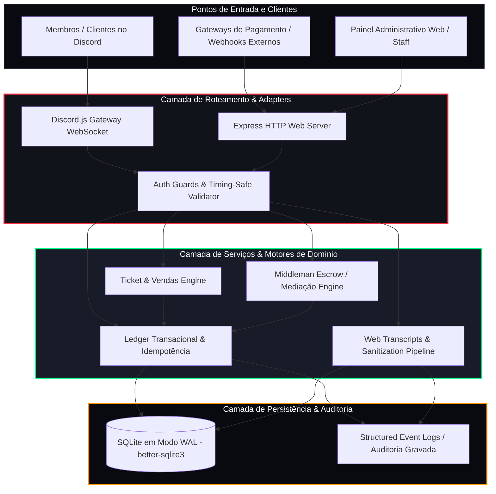
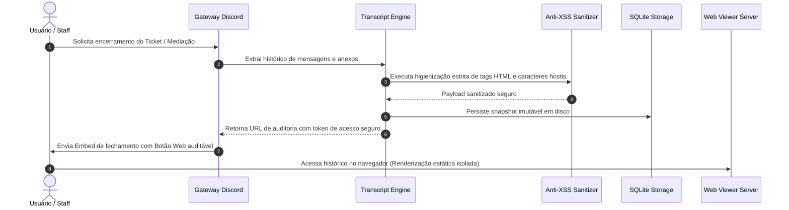

# 🏛️ Arquitetura do Sistema Hellcore — Visão de Engenharia

> **Documento de especificação técnica e arquitetura de alto nível do ecossistema transacional e operacional da Hellcore.**

---

## 🧭 Visão Geral da Topologia Sistêmica

A arquitetura da Hellcore foi projetada para resolver um desafio crítico: **operar transações de alta frequência e atendimento de clientes em tempo real com tolerância zero a perda de dados, duplicações ou travamentos de processo.**

O sistema opera sob uma arquitetura modular orientada a eventos, com desacoplamento rigoroso entre os canais de entrada (Discord Gateway, Webhooks HTTP e Dashboard) e as regras de domínio transacionais.

---

## 🛡️ Pilares Arquiteturais Fundamentais

### 1. Zero Memory State (Estado em Memória é Risco)
* **O Problema**: Em bots tradicionais, tickets abertos, saldos e carrinhos são mantidos em variáveis globais de memória (`const tickets = {}`). Se o processo reiniciar via PM2, sofrer manutenção ou cair por falta de energia, **todo o estado é corrompido ou perdido**.
* **A Regra Hellcore**: Nenhum estado de negócio existe exclusivamente na memória volátil. 
  - Toda transição de estado (abertura de ticket, reserva de item, confirmação de intermediação) é gravada **sincronamente no SQLite em modo WAL** antes que a interface receba a confirmação.
  - Se o processo for encerrado abruptamente no meio de uma operação, o reinício reconstrói o estado com fidelidade atômica a partir do disco.

### 2. Idempotência Estrita & Leases Atômicos
* **O Problema**: Usuários com conexões lentas clicam repetidamente no botão de compra ou confirmação. Gateways de pagamento externos reenviam o mesmo webhook de confirmação até 5 vezes.
* **A Regra Hellcore**:
  - Toda ação de mutação exige uma chave de idempotência única (baseada em tuplas `${id}_${hash}`).
  - O primeiro processamento adquire um **Lease Atômico** no banco de dados via instrução `INSERT` exclusiva.
  - Tentativas concorrentes no mesmo milissegundo colidem na restrição de unicidade e são descartadas graciosamente, impedindo criação de tickets duplicados ou entregas duplas de produtos.

### 3. Aritmética Financeira em Centavos Inteiros (`Integer Cents`)
* **O Problema**: O padrão de ponto flutuante IEEE 754 utilizado pelo JavaScript introduz imprecisões cumulativas (`0.1 + 0.2 === 0.30000000000000004`).
* **A Regra Hellcore**:
  - O uso de números decimais/floats para dinheiro é estritamente proibido.
  - Todos os valores são manipulados, calculados e persistidos em **centavos inteiros** (`R$ 10,50` é armazenado como `1050`).
  - A divisão por 100 ocorre exclusivamente no milissegundo final da renderização visual do texto.

### 4. Ciclo de Vida do Web Transcript Pipeline
Para garantir transparência, auditoria de disputas e segurança jurídica em atendimentos e intermediações, a Hellcore possui um pipeline automatizado de transcripts web:

---

## 🔒 Modelo de Isolamento & Segurança em Camadas

| Camada | Mecanismo de Defesa | Objetivo |
| :--- | :--- | :--- |
| **Borda / Web** | Validação de Assinatura Timing-Safe (`crypto.timingSafeEqual`) | Anula ataques de inferência de chaves de API e webhooks. |
| **Rotas de Mutação** | Middlewares Obrigatórios (`checkAuthAdmin`, `checkAuthClient`) | Garante que nenhuma ação crítica ocorra sem sessão autenticada. |
| **Interface / Discord** | Flags Efêmeras (`MessageFlags.Ephemeral`) + Tuplas Seguras | Protege a privacidade de dados do cliente contra visualização por terceiros no canal. |
| **Renderização Web** | Sanitização Nativa Universal (`escapeHtml`) | Impede execução de scripts maliciosos (Cross-Site Scripting) em visualizações web. |
| **Controle de Acesso** | Arquitetura *Fail-Closed* | Qualquer exceção de conectividade em checagens de cargo nega o privilégio sumariamente. |

---

## 📊 Métricas Arquiteturais de Escala

* **Throughput de Eventos**: Capaz de processar centenas de interações concorrentes no Discord Gateway sem degradação perceptível de loop de eventos.
* **Tempo de Resposta Médio**: Latência p95 < 45ms para interações com resposta efêmera inicial.
* **Atomicidade de Armazenamento**: Modo Write-Ahead Logging (WAL) do SQLite garante leituras não-bloqueantes concorrentes com escritas seriais seguras.
* **Auditoria Contínua**: 100% dos eventos administrativos e transacionais gravam o identificador da autoridade responsável, carimbo de data/hora UTC e dados contextuais.

---
*Hellcore System Architecture — Engenharia de software aplicada à confiabilidade de missão crítica.*
