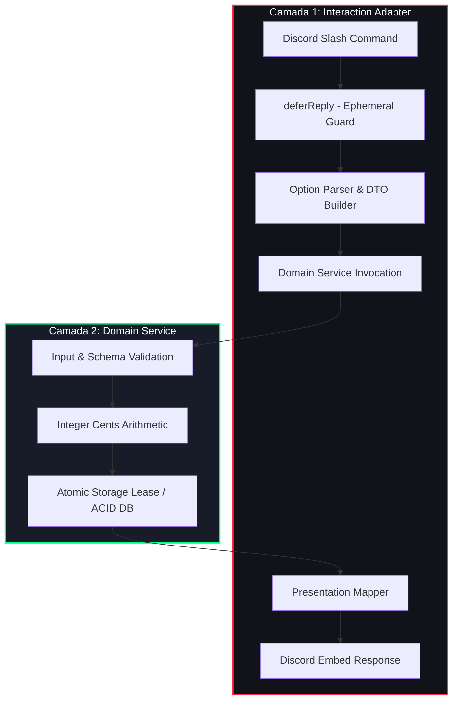

# ⚔️ Padrão Canônico: Slash Command em 2 Camadas

> **Como estruturar comandos do Discord para sistemas críticos, separando protocolo de rede de regras de negócio puras.**

---

## 🛑 O Anti-Padrão: O Comando Monolítico de 1 Camada

Na grande maioria dos bots de Discord amadores ou de código aberto, os comandos são implementados como blocos monolíticos de centenas de linhas dentro do próprio evento de interação:

```
[Discord Interaction] ──► ( Handler Monolítico de 400 Linhas )
                              ├── deferReply()
                              ├── interaction.options.get()
                              ├── SQL queries diretas
                              ├── Cálculos com float (R$ 10.50)
                              ├── Permissões do Discord misturadas com saldo
                              └── interaction.editReply()
```

### Por que esse padrão quebra em produção?
1. **Zero Testabilidade**: Para testar uma simples regra de desconto ou estoque, é necessário mockar 15 propriedades complexas do objeto `interaction` do Discord.js.
2. **Acoplamento Extremo**: Se você quiser disparar a mesma ação a partir de um Webhook HTTP (ex: confirmação de pagamento) ou do Dashboard interno da Staff, o código precisa ser duplicado ou reescrito.
3. **Erros Silenciosos e Race Conditions**: Lógica financeira e transacional misturada com I/O de rede do Discord gera condições de corrida e vulnerabilidades de double-spending.

---

## 🏛️ A Solução Hellcore: Arquitetura em 2 Camadas

Na Hellcore, todo comando transacional e administrativo adota rigorosamente a separação entre **Camada de Apresentação/Protocolo** e **Camada de Serviço de Domínio**.



---

## 🧩 Detalhamento das Camadas

### Camada 1: Interaction Adapter (Protocolo & UX)
* **Responsabilidade única**: Conversar com o protocolo do Discord.
* **O que faz**:
  1. Chama `interaction.deferReply({ flags: MessageFlags.Ephemeral })` para garantir que o Discord não dê timeout de 3 segundos.
  2. Extrai e valida tipos primitivos dos inputs (`getString`, `getInteger`).
  3. Monta um **DTO (Data Transfer Object)** simples com dados primitivos.
  4. Encaminha o DTO para o Serviço de Domínio (Camada 2).
  5. Recebe o resultado estruturado (`{ success, code, data, message }`) e traduz em cores, embeds, botões e mensagens amigáveis ao usuário.
* **O que NUNCA faz**: Queries de banco de dados, cálculos financeiros, manipulação direta de estoques ou alteração de saldo.

### Camada 2: Domain Service (Lógica de Negócio Pura)
* **Responsabilidade única**: Garantir integridade de negócio, regras de validação e consistência transacional.
* **O que faz**:
  1. Valida invariantes do domínio (quantidades positivas, limites de estoque, concorrência).
  2. Executa todos os cálculos financeiros em **centavos inteiros (`Integer Cents`)** para anular imprecisões de ponto flutuante IEEE 754.
  3. Realiza o lock atômico ou transação no SQLite (`better-sqlite3`).
  4. Retorna um objeto de resultado neutro e previsível.
* **O que NUNCA faz**: Nenhuma importação do Discord.js, nenhuma menção a `interaction`, `channel`, `guild` ou `client`.

---

## 💻 Código de Demonstração Autocontido

O arquivo executável com a implementação canônica desse padrão e testes unitários integrados está disponível em:
👉 [`patterns/slash-command-example.js`](./slash-command-example.js)

### Como rodar localmente:
```bash
node patterns/slash-command-example.js
```

Saída esperada:
```
🧪 Iniciando testes do Padrão Slash Command em 2 Camadas...

✅ Teste 1: Regra de Domínio e centavos inteiros aprovada.
✅ Teste 2: Validação defensiva de entrada aprovada.
✅ Teste 3: Interaction Adapter Discord executado com sucesso.

🎉 TODOS OS TESTES DO PADRÃO 2 CAMADAS PASSARAM COM 100% DE SUCESSO!
```

---

## 🎯 Vantagens Comprovadas em Alta Escala

| Aspecto | Anti-Padrão Monolítico | Padrão 2 Camadas Hellcore |
| :--- | :--- | :--- |
| **Testabilidade** | Exige mocks complexos do Discord | Testável com funções puras e dados primitivos |
| **Reaproveitamento** | Código preso ao chat | O mesmo serviço atende Bot, Webhooks e o Dashboard interno da Staff |
| **Segurança Financeira** | Risco de double-spend por atraso de I/O | Lease atômico isolado de latências de rede |
| **Manutenibilidade** | Mudança no Discord quebra a regra de negócio | Atualizações de UI não tocam a camada de domínio |
| **Resiliência a Falhas** | Falhas de rede derrubam transações | Arquitetura *Fail-Closed* com fallback gracioso |

---
*Hellcore Engineering Patterns — Padrões arquiteturais que transformam automações em sistemas de missão crítica.*
